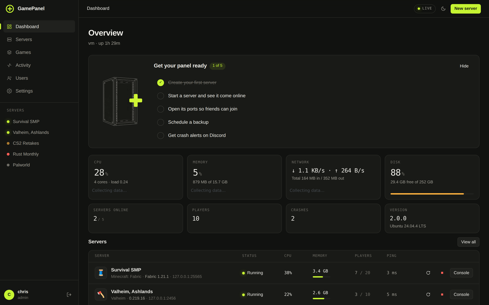
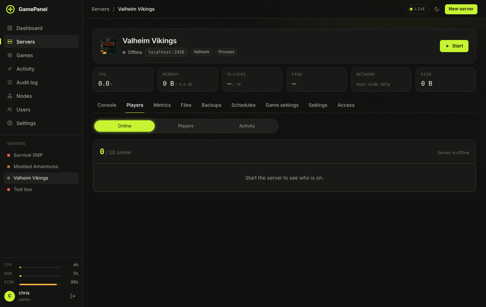
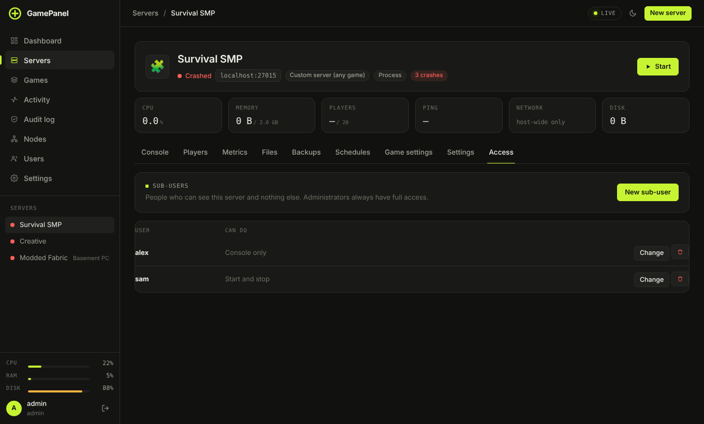
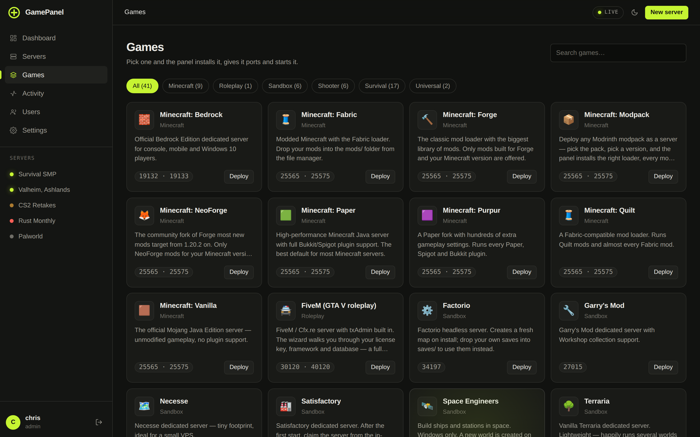
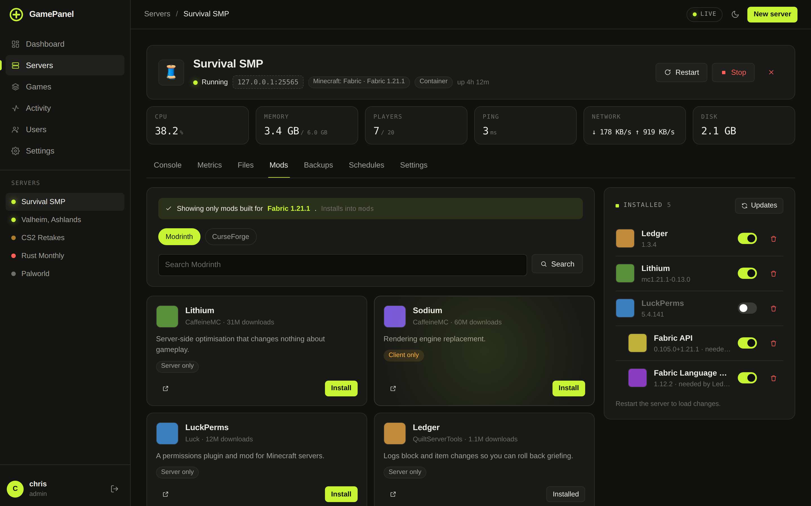
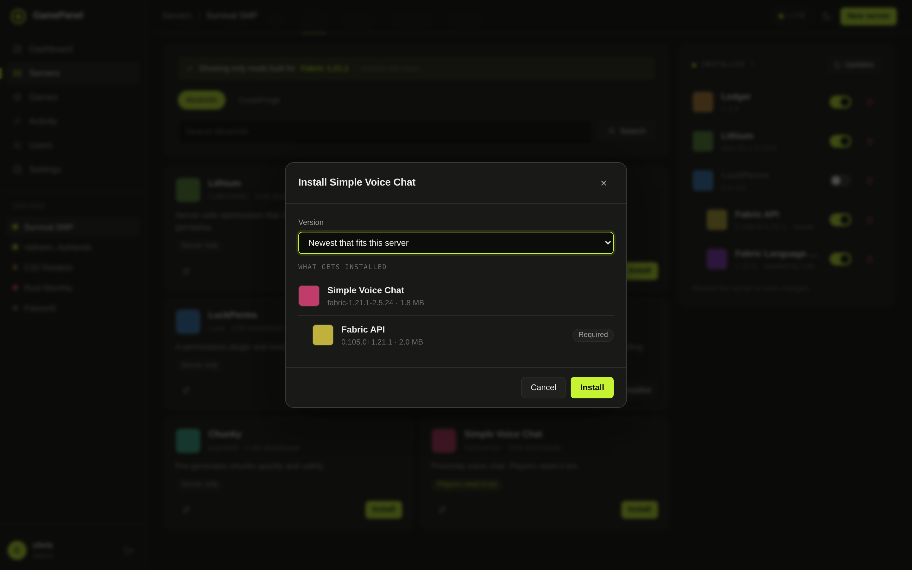

<p align="center">
  
  
</p>

<p align="center">
  <b>Run game servers from your browser, on Linux or Windows.</b><br />
  One install command. 61 games. Mods that only list what fits your server.
</p>

<p align="center">
  <a href="#install">Install</a> ·
  <a href="#games">Games</a> ·
  <a href="#one-click-mods">Mods</a> ·
  <a href="docs/guide/README.md">User guide</a> ·
  <a href="docs/troubleshooting.md">Help</a>
</p>

<p align="center">
  
</p>

---

## Install

**Ubuntu or Debian**

```bash
curl -fsSL https://raw.githubusercontent.com/jebster33/gamepanel/main/install.sh | sudo bash
```

**Windows 10, 11 or Server 2016 and newer** — pick one:

- Download **GamePanel-Setup.exe** from [Releases](https://github.com/jebster33/gamepanel/releases) and run it, or
- paste this into PowerShell opened as Administrator:

  ```powershell
  irm https://raw.githubusercontent.com/jebster33/gamepanel/main/windows/install.ps1 | iex
  ```

Then open **http://localhost:8420** (or `http://<server-ip>:8420`) and create your admin account.
The installers set up everything else: Node.js, the background service, the firewall rule and, on Linux, Docker.
Step by step: [Linux](docs/guide/install-linux.md) · [Windows](docs/guide/install-windows.md) · [First setup](docs/guide/first-setup.md)

<details>
<summary>Install options</summary>

| | Linux | Windows |
|---|---|---|
| Different port | `curl … \| sudo GP_PORT=9000 bash` | `$env:GP_PORT=9000; irm … \| iex` |
| No Docker | `curl … \| sudo GP_SKIP_DOCKER=1 bash` | not used on Windows |
| Portable, no service | `git clone` then `node server/index.js` | unzip `GamePanel-…-windows-x64.zip`, run `start.cmd` |
| Update | Settings → Panel updates, or run the installer again | same |
| Uninstall (removes everything) | `sudo /opt/gamepanel/uninstall.sh` | Apps → GamePanel, or `windows\uninstall.ps1` |
| Uninstall, keep servers | `sudo /opt/gamepanel/uninstall.sh --keep-data` | `windows\uninstall.ps1 -KeepData` |

Your servers, backups and settings stay through updates:
`/var/lib/gamepanel` on Linux, `C:\ProgramData\GamePanel` on Windows. Uninstalling removes them
too (after asking), along with users, bridge connections and the containers GamePanel built.
</details>

## What you get

**Servers**

| | |
|---|---|
| **Create a server in a minute** | Pick a game; the panel downloads it, gives it free ports and starts it. Or [import one you already run](docs/guide/create-server.md#import-a-server-you-already-have): servers left by Pterodactyl, AMP or LinuxGSM are found and brought over in a few clicks. |
| **Live console** | Colour-coded, with command history, Tab completion and RCON. When a server crashes, the **Crash doctor** says why in plain words and offers the fix. |
| **Mods and modpacks** | Modrinth, CurseForge, Hangar, SpigotMC, uMod, Steam Workshop and the Factorio portal, filtered to your loader and version. Modrinth and CurseForge packs in one click. A **mod check** looks inside the jars for wrong loaders, missing dependencies and clashes. [Guide](docs/guide/mods-and-modpacks.md) |
| **Plugin and mod configs as forms** | The Configs tab shows plugin and mod config files (YAML, TOML, JSON, .cfg, .properties) as toggles, numbers and lists; comments stay as they were. |
| **Minecraft networks** | A Velocity proxy in front of your Paper and Purpur servers, with forwarding set up on both ends. |
| **Minecraft extras** | Switch version or loader, manage worlds, edit game rules, MOTD and icon, Bedrock crossplay, BlueMap, Chunky pre-generation. |
| **Schedules** | Restarts with in-game warnings, backups, commands, game and mod updates; skip while people are playing. Rust wipes on the first Thursday of the month, blueprints optional. |
| **Backups** | One click or scheduled, restore whole or single files, copied to Backblaze B2, Cloudflare R2, S3 or MinIO. Optional incremental backups (only changes are stored) with AES-256 encryption, and checks that test-restore each backup. [Guide](docs/guide/backups.md) |
| **Files** | Browse, edit, search, drag-and-drop upload, unzip in place. Or use FileZilla and WinSCP over the built-in **SFTP**, signed in with panel accounts. |
| **Many servers at once** | Select servers and start, stop, restart, update or back them up together. |
| **Graphs with history** | CPU, memory, players and ping for the last hour up to 30 days. |
| **Automatic updates** | Steam games update themselves when a new build is out and nobody is playing. |

**Players and community**

| | |
|---|---|
| **Players** | Who is on, history and play time, profiles with stats, kick and ban, whitelist, ops, maintenance mode. [Guide](docs/guide/players.md) |
| **Chat moderation** | Word list (it sees through leetspeak), links, shouting and spam, with a warn → mute → kick → temporary ban ladder. |
| **Shared bans** | One ban list for every server, with a public page where banned players can appeal. |
| **Whitelist from Discord roles** | Members with the roles you pick are whitelisted, and taken off when they lose them. |
| **Discord** | Alerts by webhook, a bot with `/status`, `/players`, `/start`…, and two-way chat per server. Slack and ntfy too. [Guide](docs/guide/alerts-and-discord.md) |
| **Status page** | A public page with who is on, uptime and leaderboards. |
| **Phone app** | Home-screen app with console, players and push notifications. |

**Running the panel**

| | |
|---|---|
| **Sharing** | Give friends one server (console only, start/stop, files only or custom) from its Access tab. [Guide](docs/guide/users-and-2fa.md) |
| **Two-factor sign-in and passkeys** | Codes from any authenticator app, passkeys (fingerprint, face or security key), and an option to require two-factor for admins. |
| **Built-in HTTPS** | A free Let's Encrypt certificate for your domain, renewed by itself. No reverse proxy needed. |
| **Multiple machines** | Add other GamePanel installs as [nodes](docs/guide/nodes.md) and run their servers from one panel; move a server from one machine to another. |
| **Limits** | Caps on total memory, CPU per server and storage. [Guide](docs/guide/panel-settings.md#limits) |
| **Audit log** | Every change anyone makes, with who, what, which server and from where. |
| **Reachability** | Opens ports in the firewall and on your router (UPnP), or tells you exactly what to forward. |
| **Bridge** | Or skip port forwarding: friends run a personal client and your servers appear on their computer, encrypted end to end. [How it works](docs/bridge.md) |
| **Isolation on Linux** | Every server in its own Docker container with hard memory and CPU limits. |
| **API** | Keys for scripts and bots, read-only or full. [Reference](docs/api.md) |
| **Ready-made setups** | A Survival SMP with LuckPerms and EssentialsX, a fast Fabric server, a Rust community server… in one click. Save any server as a setup of your own. |
| **Quotas** | Let friends create their own servers, up to a number, memory and disk you set. |
| **Config history** | Every config save is kept: see what changed and put an older version back. |
| **Scheduled events** | Optional: a double XP weekend that turns itself on and off. |
| **Server list page** | A public page with who is on, the MOTD, Join buttons and your Discord and vote links, with your own logo and colour. |
| **Update channels** | Stable (tagged releases) or beta for the panel itself. |
| **World maps** | Rust (RustMaps), Valheim (valheim-map.world) and Terraria (TerraMap), next to Minecraft's live BlueMap. |
| **Sign in with Google, Discord or GitHub** | Link one on your Account page and skip the password. |
| **Languages** | English, Nederlands, Deutsch, Español, Français, Português. |
| **Notifications** | A bell for crashes, installs and backups, with pop-ups and desktop alerts. |

<table>
  <tr>
    <td></td>
    <td></td>
  </tr>
  <tr>
    <td align="center">Console</td>
    <td align="center">Players</td>
  </tr>
  <tr>
    <td></td>
    <td></td>
  </tr>
  <tr>
    <td align="center">Graphs with history</td>
    <td align="center">Sharing a server</td>
  </tr>
  <tr>
    <td></td>
    <td></td>
  </tr>
  <tr>
    <td align="center">Pick a game</td>
    <td align="center">Several machines</td>
  </tr>
</table>

## Games

✓ = installs and boots in CI on every change. Games marked † need your own key or token to boot, so CI checks the install only.
Games marked ‡ are too big for the CI machines on that system, so CI skips them there.

| Game | Linux | Windows | Mods |
|---|:-:|:-:|---|
| **Minecraft** Paper · Purpur | ✓ | ✓ | Modrinth, CurseForge (plugins) |
| **Minecraft** Fabric · Quilt · Forge · NeoForge | ✓ | ✓ | Modrinth, CurseForge |
| **Minecraft** any Modrinth modpack | ✓ | ✓ | the pack, plus extra mods |
| **Minecraft** Vanilla · Bedrock | ✓ | ✓ | |
| Counter-Strike 2 ‡ (Windows) · Team Fortress 2 · Left 4 Dead 2 | ✓ | ✓ | |
| Counter-Strike: Source · Day of Defeat: Source · Half-Life 2: Deathmatch | ✓ | ✓ | |
| Left 4 Dead · No More Room in Hell · Sven Co-op | ✓ | ✓ | |
| Insurgency (2014) · Day of Infamy · MORDHAU | ✓ | ✓ | |
| Killing Floor 2 | ✓ | ✓ | Steam Workshop |
| Squad · Squad 44 · Insurgency: Sandstorm · Arma Reforger | ✓ | ✓ | |
| SCP: Secret Laboratory | ✓ | ✓ | |
| Arma 3 · DayZ (need a Steam login) | ✓ | ✓ | Steam Workshop |
| Rust | ✓ | ✓ | uMod / Oxide |
| ARK: Survival Evolved | ✓ | ✓ | Steam Workshop |
| ARK: Survival Ascended | | ✓ | |
| Valheim · Palworld · Enshrouded · V Rising · Soulmask | ✓ | ✓ | |
| 7 Days to Die · Core Keeper · Barotrauma | ✓ | ✓ | |
| Project Zomboid · Unturned | ✓ | ✓ | Steam Workshop |
| Garry's Mod | ✓ | ✓ | Steam Workshop |
| Terraria · Satisfactory · Necesse · Eco · Mindustry | ✓ | ✓ | |
| Avorion | ✓ | ✓ | Steam Workshop |
| Terraria with tModLoader | ✓ | ✓ | Steam Workshop |
| ICARUS · Empyrion (Wine on Linux) | ✓ | ✓ | |
| Factorio | ✓ | | Factorio mod portal |
| Conan Exiles · Space Engineers | | ✓ | Steam Workshop |
| Sons of the Forest · Abiotic Factor | | ✓ | |
| FiveM (GTA V roleplay) † | ✓ | ✓ | |
| Don't Starve Together † | ✓ | ✓ | Steam Workshop |
| Any Steam game by App ID · any custom command | ✓ | ✓ | |

Missing one? A template is a short JSON file: see [docs/templates.md](docs/templates.md).

## One-click mods



- **Only compatible mods are listed.** A Fabric 1.21.1 server sees Fabric builds for 1.21.1; a Forge
  server never sees Fabric mods. Paper and Purpur get plugins, and NeoForge 1.20.1 also gets Forge builds, since that version loads them.
- **You see the plan first.** Installing shows the mod and every dependency it pulls in, then downloads them together.
- **Client-only mods are refused**, because one of them stops a Forge server from booting. Mods that players need too are labelled.
- **Updates stay compatible.** "Updates" only offers newer releases for the same loader and version.
- **Removing cleans up.** Dependencies nothing else needs are removed with the mod; disabling is a switch.
- **Steam Workshop works per game**: Garry's Mod addons are unpacked, Unturned and ARK get the item added to their own mod lists, Project Zomboid gets `WorkshopItems` and `Mods` written for you.
  Arma 3 and DayZ mods become `@` folders on `-mod=` with their keys copied, Conan Exiles `.pak` files land in `modlist.txt`,
  tModLoader mods are switched on in `enabled.json`, and Space Engineers and Don't Starve Together get the item added to their configs and download it themselves.



**Modpacks:** create a *Minecraft: Modpack* server, pick a Modrinth or CurseForge pack and a version, and the
panel installs the loader, every mod and the pack's configs. Changing the pack later keeps your world.
More in the [mods guide](docs/guide/mods-and-modpacks.md).

## Compared with other panels

| | GamePanel | Pterodactyl / Pelican | AMP | WindowsGSM | LinuxGSM |
|---|---|---|---|---|---|
| Price | free | free | paid licence | free | free |
| Runs on | Linux, Windows | Linux | Linux, Windows | Windows | Linux |
| Setup | one command | web server, PHP, database, Redis, daemon | installer | desktop app | per game, CLI |
| Web UI | ✓ | ✓ | ✓ | | |
| Mods filtered by loader | ✓ | via add-ons | some games | | |
| Built-in HTTPS | ✓ | via web server | ✓ | | |
| SFTP | ✓ | ✓ | ✓ | | |
| Passkeys | ✓ | | | | |

GamePanel is one Node.js process with no dependencies and no database. It talks to Docker directly on
Linux and runs games as normal processes on Windows.

## Everyday commands

| | Linux | Windows (PowerShell) |
|---|---|---|
| Status | `systemctl status gamepanel` | `Get-Service GamePanel` |
| Restart | `sudo systemctl restart gamepanel` | `Restart-Service GamePanel` |
| Logs | `journalctl -u gamepanel -f` | `C:\ProgramData\GamePanel\logs` |
| Update | `sudo /opt/gamepanel/update.sh` | run the installer again |

## Settings from the environment

`GP_PORT`, `GP_HOST`, `GP_DATA_DIR`, `GP_BEHIND_PROXY`, `GP_DOCKER_SOCKET` and `GP_LOG_LEVEL`: see
[Panel settings](docs/guide/panel-settings.md#environment-variables).

**HTTPS:** put it behind Caddy (`panel.example.com { reverse_proxy 127.0.0.1:8420 }`) and set `GP_BEHIND_PROXY=1`.

## Documentation

**[User guide](docs/guide/README.md)**, start to finish:
[Install on Linux](docs/guide/install-linux.md) ·
[Install on Windows](docs/guide/install-windows.md) ·
[First setup](docs/guide/first-setup.md) ·
[Create a server](docs/guide/create-server.md) ·
[Running a server](docs/guide/running-a-server.md) ·
[Mods and modpacks](docs/guide/mods-and-modpacks.md) ·
[Players](docs/guide/players.md) ·
[Backups](docs/guide/backups.md) ·
[Alerts and Discord](docs/guide/alerts-and-discord.md) ·
[Bridge](docs/bridge.md) ·
[Nodes](docs/guide/nodes.md) ·
[Users and 2FA](docs/guide/users-and-2fa.md) ·
[Panel settings and limits](docs/guide/panel-settings.md) ·
[Updating and uninstalling](docs/guide/uninstall.md)

Reference: [Add a game (templates)](docs/templates.md) · [Security](docs/security.md), please read before
exposing the panel to the internet · [Troubleshooting](docs/troubleshooting.md) · [HTTP API](docs/api.md)

**Developing:** `node server/index.js` runs the panel from a checkout. `npm test` checks every template and
the UI modules; `node test/smoke.js --template=valheim` installs and boots a real server. The UI is plain
ES modules in `public/js` (`core/`, `ui/`, `pages/`), with no build step.

MIT licence. See [LICENSE](LICENSE).
