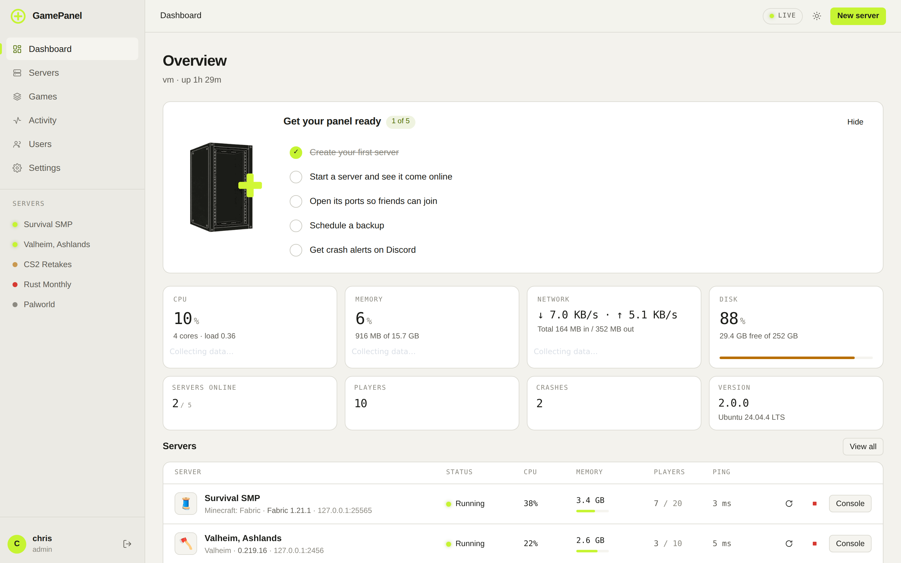

<p align="center">
  
  
</p>

<p align="center">
  <b>Run game servers from your browser, on Linux or Windows.</b><br />
  One install command. 61 games. Mods that only list what fits your server.
</p>

<p align="center">
  <a href="#install">Install</a> ·
  <a href="#games">Games</a> ·
  <a href="#one-click-mods">Mods</a> ·
  <a href="docs/templates.md">Add a game</a> ·
  <a href="docs/troubleshooting.md">Help</a>
</p>

<p align="center">
  
</p>

---

## Install

**Ubuntu or Debian**

```bash
curl -fsSL https://raw.githubusercontent.com/jebster33/gamepanel/main/install.sh | sudo bash
```

**Windows 10, 11 or Server 2016 and newer** — pick one:

- Download **GamePanel-Setup.exe** from [Releases](https://github.com/jebster33/gamepanel/releases) and run it, or
- paste this into PowerShell opened as Administrator:

  ```powershell
  irm https://raw.githubusercontent.com/jebster33/gamepanel/main/windows/install.ps1 | iex
  ```

Then open **http://localhost:8420** (or `http://<server-ip>:8420`) and create your admin account.
The installers set up everything else: Node.js, the background service, the firewall rule and, on Linux, Docker.

<details>
<summary>Install options</summary>

| | Linux | Windows |
|---|---|---|
| Different port | `curl … \| sudo GP_PORT=9000 bash` | `$env:GP_PORT=9000; irm … \| iex` |
| No Docker | `curl … \| sudo GP_SKIP_DOCKER=1 bash` | not used on Windows |
| Portable, no service | `git clone` then `node server/index.js` | unzip `GamePanel-…-windows-x64.zip`, run `start.cmd` |
| Update | Settings → Panel updates, or run the installer again | same |
| Uninstall (removes everything) | `sudo /opt/gamepanel/uninstall.sh` | Apps → GamePanel, or `windows\uninstall.ps1` |
| Uninstall, keep servers | `sudo /opt/gamepanel/uninstall.sh --keep-data` | `windows\uninstall.ps1 -KeepData` |

Your servers, backups and settings stay through updates:
`/var/lib/gamepanel` on Linux, `C:\ProgramData\GamePanel` on Windows. Uninstalling removes them
too (after asking), along with users, bridge connections and the containers GamePanel built.
</details>

## What you get

| | |
|---|---|
| **Create a server in a minute** | Pick a game, the panel downloads it, gives it free ports and starts it. |
| **Live console** | Colour-coded output you can type into, with RCON where the game has it. |
| **Live player list** | Who is on, for how long, and their score where the game reports it, with kick and ban. |
| **Import existing** | Already have a server on this machine? Point the panel at its folder; nothing is reinstalled. |
| **Two-factor sign-in** | Codes from any authenticator app: Apple Passwords, Google or Microsoft Authenticator, 2FAS, Aegis… |
| **One-click modpacks** | Install Modrinth and CurseForge packs, loader and all. |
| **One-click mods** | Modrinth, CurseForge, uMod, Steam Workshop and the Factorio portal, filtered to your loader and version. |
| **Schedules** | Nightly restarts, backups every few hours, a console message on the hour. |
| **Backups** | One click, scheduled, downloadable, restorable, and optionally copied to Backblaze B2, Cloudflare R2, S3 or MinIO. |
| **Files** | Browse, edit, drag-and-drop upload, unzip in place. |
| **Alerts** | Crashes and failed backups posted to Discord. |
| **Sharing** | Give friends access to one server (console only, start/stop, files only or custom) from the server's Access tab. |
| **Multiple machines** | Add other GamePanel installs as named nodes and run their servers from one panel. |
| **Graphs with history** | CPU, memory and players per server for the last hour up to 30 days. |
| **Audit log** | Every change anyone makes, with who, what, which server and from where. |
| **Automatic updates** | Steam games update themselves when a new build is out and nobody is playing. |
| **Reachability** | Opens the server's ports in the firewall and on your router (UPnP), or tells you exactly what to forward. |
| **Bridge** | Or skip port forwarding: friends run a personal client and your servers appear on their computer, encrypted end to end. [How it works](docs/bridge.md) |
| **Isolation on Linux** | Every server in its own Docker container with hard memory and CPU limits. |

<table>
  <tr>
    <td></td>
    <td></td>
  </tr>
  <tr>
    <td align="center">Console</td>
    <td align="center">Schedules</td>
  </tr>
  <tr>
    <td></td>
    <td></td>
  </tr>
  <tr>
    <td align="center">Pick a game</td>
    <td align="center">Light theme</td>
  </tr>
</table>

## Games

✓ = installs and boots in CI on every change. Games marked † need your own key or token to boot, so CI checks the install only.
Games marked ‡ are too big for the CI machines on that system, so CI skips them there.

| Game | Linux | Windows | Mods |
|---|:-:|:-:|---|
| **Minecraft** Paper · Purpur | ✓ | ✓ | Modrinth, CurseForge (plugins) |
| **Minecraft** Fabric · Quilt · Forge · NeoForge | ✓ | ✓ | Modrinth, CurseForge |
| **Minecraft** any Modrinth modpack | ✓ | ✓ | the pack, plus extra mods |
| **Minecraft** Vanilla · Bedrock | ✓ | ✓ | |
| Counter-Strike 2 ‡ (Windows) · Team Fortress 2 · Left 4 Dead 2 | ✓ | ✓ | |
| Counter-Strike: Source · Day of Defeat: Source · Half-Life 2: Deathmatch | ✓ | ✓ | |
| Left 4 Dead · No More Room in Hell · Sven Co-op | ✓ | ✓ | |
| Insurgency (2014) · Day of Infamy · Killing Floor 2 · MORDHAU | ✓ | ✓ | |
| Squad · Squad 44 · Insurgency: Sandstorm · Arma Reforger | ✓ | ✓ | |
| SCP: Secret Laboratory | ✓ | ✓ | |
| Arma 3 · DayZ (need a Steam login) | ✓ | ✓ | Steam Workshop |
| Rust | ✓ | ✓ | uMod / Oxide |
| ARK: Survival Evolved | ✓ | ✓ | Steam Workshop |
| ARK: Survival Ascended | | ✓ | |
| Valheim · Palworld · Enshrouded · V Rising · Soulmask | ✓ | ✓ | |
| 7 Days to Die · Core Keeper · Barotrauma | ✓ | ✓ | |
| Project Zomboid · Unturned | ✓ | ✓ | Steam Workshop |
| Garry's Mod | ✓ | ✓ | Steam Workshop |
| Terraria · Satisfactory · Necesse · Avorion · Eco · Mindustry | ✓ | ✓ | |
| Terraria with tModLoader | ✓ | ✓ | Steam Workshop |
| ICARUS · Empyrion (Wine on Linux) | ✓ | ✓ | |
| Factorio | ✓ | | Factorio mod portal |
| Conan Exiles · Space Engineers | | ✓ | Steam Workshop |
| Sons of the Forest · Abiotic Factor | | ✓ | |
| FiveM (GTA V roleplay) † | ✓ | ✓ | |
| Don't Starve Together † | ✓ | ✓ | Steam Workshop |
| Any Steam game by App ID · any custom command | ✓ | ✓ | |

Missing one? A template is a short JSON file: see [docs/templates.md](docs/templates.md).

## One-click mods


- **Only compatible mods are listed.** A Fabric 1.21.1 server sees Fabric builds for 1.21.1; a Forge
  server never sees Fabric mods. Paper and Purpur get plugins, and NeoForge 1.20.1 also gets Forge builds, since that version loads them.
- **You see the plan first.** Installing shows the mod and every dependency it pulls in, then downloads them together.
- **Client-only mods are refused**, because one of them stops a Forge server from booting. Mods that players need too are labelled.
- **Updates stay compatible.** "Updates" only offers newer releases for the same loader and version.
- **Removing cleans up.** Dependencies nothing else needs are removed with the mod; disabling is a switch.
- **Steam Workshop works per game**: Garry's Mod addons are unpacked, Unturned and ARK get the item added to their own mod lists, Project Zomboid gets `WorkshopItems` and `Mods` written for you.
  Arma 3 and DayZ mods become `@` folders on `-mod=` with their keys copied, Conan Exiles `.pak` files land in `modlist.txt`,
  tModLoader mods are switched on in `enabled.json`, and Space Engineers and Don't Starve Together get the item added to their configs and download it themselves.


## Compared with other panels

| | GamePanel | Pterodactyl / Pelican | AMP | WindowsGSM | LinuxGSM |
|---|---|---|---|---|---|
| Price | free | free | paid licence | free | free |
| Runs on | Linux, Windows | Linux | Linux, Windows | Windows | Linux |
| Setup | one command | web server, PHP, database, Redis, daemon | installer | desktop app | per game, CLI |
| Web UI | ✓ | ✓ | ✓ | | |
| Mods filtered by loader | ✓ | via add-ons | some games | | |

GamePanel is one Node.js process with no dependencies and no database. It talks to Docker directly on
Linux and runs games as normal processes on Windows.

## Everyday commands

| | Linux | Windows (PowerShell) |
|---|---|---|
| Status | `systemctl status gamepanel` | `Get-Service GamePanel` |
| Restart | `sudo systemctl restart gamepanel` | `Restart-Service GamePanel` |
| Logs | `journalctl -u gamepanel -f` | `C:\ProgramData\GamePanel\logs` |
| Update | `sudo /opt/gamepanel/update.sh` | run the installer again |

## Settings from the environment

| Variable | Default | |
|---|---|---|
| `GP_PORT` | `8420` | Panel port |
| `GP_HOST` | `0.0.0.0` | Address to listen on |
| `GP_DATA_DIR` | see above | Where servers and settings live |
| `GP_BEHIND_PROXY` | `0` | Trust `X-Forwarded-*` headers behind a reverse proxy |
| `GP_DOCKER_SOCKET` | `/var/run/docker.sock` | Docker socket |
| `GP_LOG_LEVEL` | `info` | `debug`, `info`, `warn`, `error` |

**HTTPS:** put it behind Caddy (`panel.example.com { reverse_proxy 127.0.0.1:8420 }`) and set `GP_BEHIND_PROXY=1`.

## More

- [Add a game (templates)](docs/templates.md)
- [Security and isolation](docs/security.md), please read before exposing the panel to the internet
- [Troubleshooting](docs/troubleshooting.md)
- [HTTP API](docs/api.md)

**Developing:** `node server/index.js` runs the panel from a checkout. `npm test` checks every template and
the UI modules; `node test/smoke.js --template=valheim` installs and boots a real server. The UI is plain
ES modules in `public/js` (`core/`, `ui/`, `pages/`), with no build step.

MIT licence. See [LICENSE](LICENSE).
