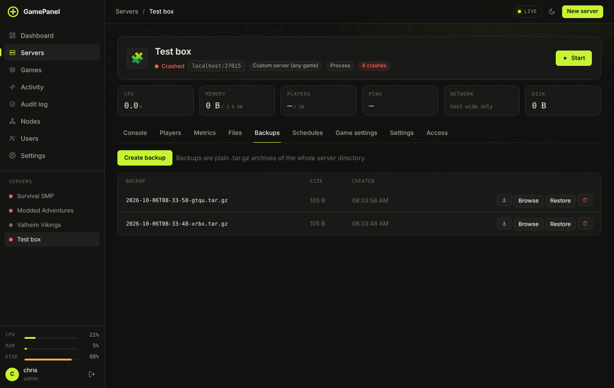

# Backups

A backup is a plain `.tar.gz` of the whole server folder, so you can open it anywhere.

## Making backups

- **By hand:** **Backups → Create backup**.
- **On a timer:** **Schedules → Add task** with **Make a backup**, for example every 6 hours.
- **Automatically:** the panel backs up before risky changes, like switching the Minecraft version or
  resetting a world.

## Restoring

- **Restore** puts the whole server back the way it was. Stop the server first; current files are
  overwritten. Before anything happens, the **restore preview** compares the backup with the server as it
  is now: files that come back (deleted since), files that go back to how they were (changed since) and
  files added since, per folder, with plugin and mod jars and `server.properties` compared by name and
  setting. A normal restore leaves files added since in place; tick **Make it exactly like the backup**
  to delete them too. **Back up the server as it is now first** (on by default) makes the restore undoable.
- **Browse** opens the archive. Tick single files or folders and **Restore selected** to put back only
  those (a broken config, one world) and leave everything else alone. Administrators only.
- The download button saves the archive to your computer.

## Incremental and encrypted backups

On a server's Backups tab, **Backup type…** switches between *Archive* (a complete `.tar.gz` each time, the default) and *Incremental*. Incremental backups store files as pieces, each piece once: the first backup is full size, later ones only add what changed, and unchanged files are not even read again. Restoring, restoring single files, browsing, checking and downloading (as a `.tar.gz`) all work the same. Cloud copies stay archive-only.

Incremental backups can be encrypted with AES-256. An administrator sets the passphrase under **Settings → Backup encryption**; write it down, because without it encrypted backups cannot be restored on another machine. Changing the passphrase later keeps every encrypted backup readable.

## Checking backups

**Check** on a backup unpacks it into a scratch folder and makes sure every file came back (for incremental backups, every piece is read and verified). Turn on **Settings → Backup checks** to check each backup right after it is made; a failed check sends an alert.

## Cloud copies

**Settings → Cloud backups** copies every backup, by hand or scheduled, to an S3-compatible bucket so a
dead disk doesn't take your worlds with it. Works with Backblaze B2, Cloudflare R2, Amazon S3, Wasabi and
MinIO.

1. Make a bucket, and a key that can only reach that bucket.
2. Pick your provider, fill in **Endpoint**, **Bucket**, **Region** (often guessed from the endpoint),
   **Access key ID** and **Secret access key**. **Folder in the bucket** is optional.
3. **Copies to keep per server**: 0 keeps every copy, or let a bucket lifecycle rule expire them.
4. **Test connection** writes, lists and deletes a small file, so you see the bucket's own error if
   something is wrong ([common errors](../troubleshooting.md#cloud-backups)).

After that the Backups tab gets a **Cloud** column. **Copy** retries an upload that failed. Backups that
are **Only in the cloud** have **Bring back**, which downloads them to the panel so you can restore them
like any other. Failed uploads are posted to your alerts when that alert is ticked.

## Copies on another node

**Settings → Backup copies on another node** sends every new archive backup to one of your
[nodes](nodes.md), another machine running GamePanel. Nothing to sign up for, and losing this machine
does not lose the backups. Pick the node and how many copies to keep per server. The Backups tab then
gets a column named after the node, with **Copy** for backups made before it was on, and lists copies
that are **Only on** the node with **Bring back** and delete. The node keeps them as plain `.tar.gz` files
in `backups-from-nodes` inside its data folder, and refuses a copy that would leave it with less than
1 GB free. Incremental backups are not copied.

## Backing up the panel itself

**Settings → System → Back up panel settings** downloads every account, setting, key and the player
history (not server files). Keep it somewhere safe: it holds every key. To restore, stop the panel and
unpack it into the data folder.

## Disk space

**Settings → Limits → Max storage** stops new backups when servers and backups together would go over
it. See [Limits](panel-settings.md#limits).
