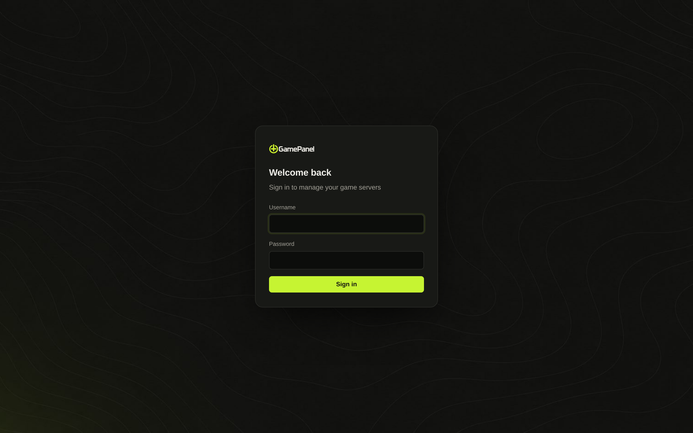
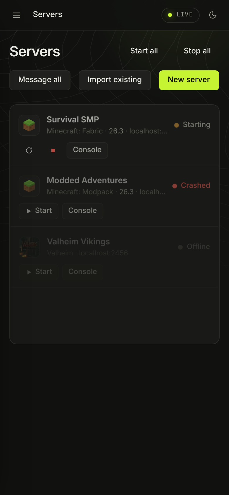

# First setup

## 1. Create the admin account

Open the panel (`http://localhost:8420` on the machine itself, `http://<server-ip>:8420` from elsewhere).
The first visit shows **Set up your panel**: pick a username and password. That account is an
administrator. Passwords need 8 or more characters, can't be a common password and can't be just your
username.

Do this straight after installing: until an account exists, whoever opens the page first gets to make it.

## 2. Turn on two-factor sign-in

**Account → Two-factor sign-in → Turn on.**

1. Scan the QR code with an authenticator app: Apple Passwords (the iPhone camera offers it), Google or
   Microsoft Authenticator, 2FAS, Aegis, 1Password…
2. Type the 6-digit code it shows.
3. **Save the recovery codes.** Each one signs you in once if you lose your phone.

Once your own account has it, you can require it for every administrator under **Users**. Lost access
anyway? See [Locked out by two-factor sign-in](../troubleshooting.md#locked-out-by-two-factor-sign-in).

## 3. Settings worth a look on day one

All under **Settings**:

| Card | Why |
|---|---|
| **Alerts** | Paste a Discord webhook so crashes and failed backups reach you. [More](alerts-and-discord.md) |
| **General** | Panel name, the port range new servers get ports from, crash auto-restart, automatic Steam game updates |
| **Integrations** | A free CurseForge API key unlocks CurseForge mods and modpacks. Modrinth, Hangar, SpigotMC and uMod need nothing. |
| **Limits** | Caps on total memory, CPU per server and storage. [More](panel-settings.md#limits) |
| **Cloud backups** | Copy every backup to a bucket off the machine. [More](backups.md#cloud-copies) |
| **GamePanel Bridge** | Let friends connect without opening ports. [More](../bridge.md) |

## Phone app

GamePanel has a home-screen app for iPhone (and Android) at `http://<panel>/app`: servers, a chat-style
console, players, power controls and push notifications for crashes, failed backups and sign-in lockouts.

1. **Account → iPhone app**: scan the QR code with the iPhone camera, or open `/app` in Safari.
2. Tap **Share**, then **Add to Home Screen**.
3. Open it from the home screen, sign in, and turn notifications on under the bell.

Push needs iOS 16.4 or newer and the app opened from the home screen. Away from home it needs an HTTPS
address for the panel ([HTTPS](install-linux.md#https)). On Android use Chrome's menu, then **Install app**.

## API keys

**Account → API keys** makes keys for scripts and bots (`Authorization: Bearer gp_…`). A key can do
what your account can, except change accounts; read-only keys can only look. Adding a
[node](nodes.md) needs a full-access key from that node. See the [API reference](../api.md).

Next: [Create a server](create-server.md).
