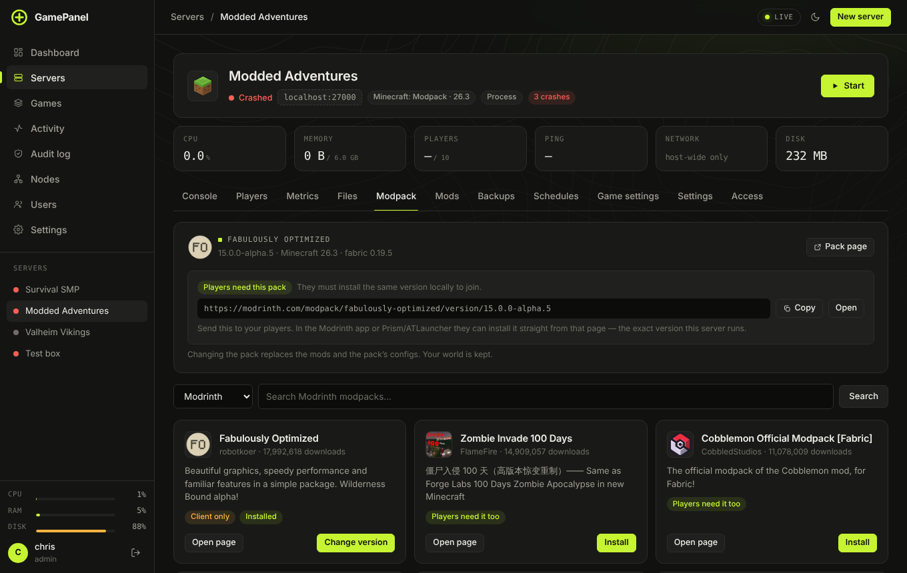

# Mods and modpacks

## Where mods come from

| Game | Sources |
|---|---|
| Minecraft Paper, Purpur | Modrinth, CurseForge, Hangar and SpigotMC (free plugins) |
| Minecraft Fabric, Quilt, Forge, NeoForge | Modrinth, CurseForge |
| Minecraft modpack servers | Modrinth and CurseForge packs, plus extra mods |
| Rust | uMod / Oxide plugins |
| Garry's Mod, ARK, Project Zomboid, Unturned | Steam Workshop |
| Factorio | The Factorio mod portal |

CurseForge needs a free API key (from console.curseforge.com) under **Settings → Integrations**. Factorio
needs your Factorio username and token there. The others work with no key.

## Installing mods

Open the server's **Mods** tab, search on the left and press install.

- **Only compatible mods are listed.** A Fabric 1.21.1 server sees Fabric builds for 1.21.1; a Forge server
  never sees Fabric mods. NeoForge 1.20.1 also gets Forge builds, since that version loads them.
- **You see the plan first:** the mod and every dependency it pulls in, downloaded together.

  

- **Client-only mods are refused**, because one of them can stop a Forge server from booting. Mods
  players need too are labelled, so you know what to tell them.
- **Updates stay compatible:** **Updates** only offers newer releases for the same loader and version. A
  schedule can run **Update mods and plugins** for you.
- **Removing cleans up:** dependencies nothing else needs go with the mod. The switch next to a mod disables it and
  keeps the file.

Restart the server to load changes.

**Steam Workshop** works per game: Garry's Mod addons are unpacked, Unturned and ARK get the item added to
their own mod lists, and Project Zomboid gets `WorkshopItems` and `Mods` written for you. Paste the
Workshop link or item ID and press **Add item**.

## Modpacks

Create a server with the **Minecraft: Modpack** game. Pick **Modrinth** or **CurseForge**, search for the
pack and choose a version. The panel installs the right loader (Fabric, Quilt, Forge or NeoForge), every
mod and the pack's own configs.

Later, the server's **Modpack** tab changes the version or swaps to another pack. Changing the pack
replaces the mods and the pack's configs; **your world is kept**. Stop the server first.

Players need the same pack and version on their own computer to join. The pack's mods are labelled
the same way as above: server only, needed by players too, or client side.

You can still add single mods to a modpack server on its **Mods** tab.
