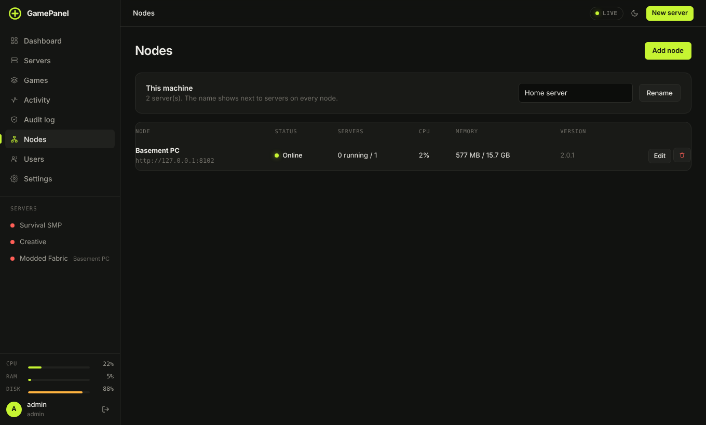

# Nodes: several machines in one panel

Have a second computer with spare RAM? Install GamePanel on it too and add it to your main panel as a
**node**. Its servers then show up in the main panel's sidebar and server list with the node's name next
to them, and you can create new servers on it from there.

## Adding a node

1. Install GamePanel on the other machine ([Linux](install-linux.md), [Windows](install-windows.md)) and
   create its admin account.
2. On **that** panel: **Account → API keys → Create key**, with **Read-only** unticked.
3. On your main panel: **Nodes → Add node**. Give it a name ("Basement PC"), its address
   (`http://192.168.1.20:8420`) and paste the key.

The Nodes page then shows each node's status, how many servers are running, CPU, memory and its GamePanel
version. **This machine** at the top sets the name your main panel shows for itself.

If the node is reached over the internet rather than your home network, give it an `https://` address
(see [HTTPS](install-linux.md#https)) so the key is never sent in the clear.

## Using it

- **New server → Node** picks which machine a new server goes on.
- Everything else (console, files, mods, backups, schedules, settings) works the same as on a local server.
  The main panel passes each request on to the node.
- Servers on other nodes are for administrators of the main panel. To share one with a friend, give them
  access on the node's own panel.
- Consoles of remote servers refresh every few seconds rather than streaming.
- If a node goes offline its servers stay in the list marked **offline** until it's back; the Nodes page
  shows when it was last heard from.

**Edit** changes a node's name, address or key. The bin button removes it from this panel only; nothing on
that machine is touched and its servers keep running.
