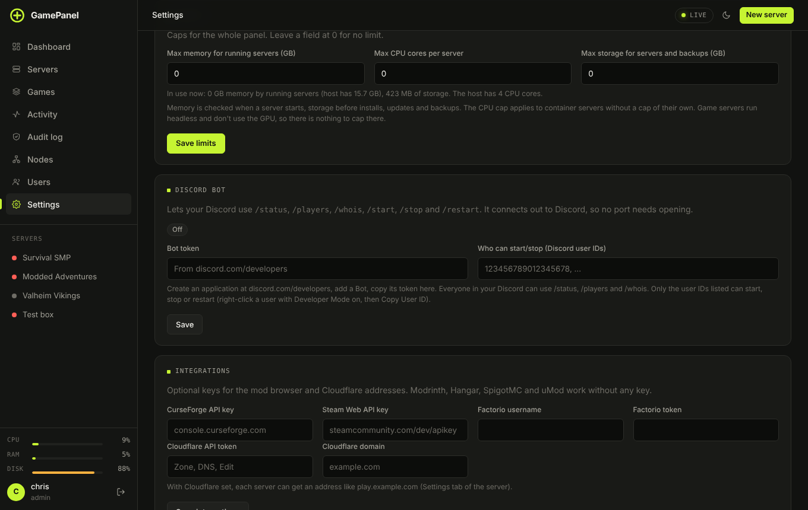
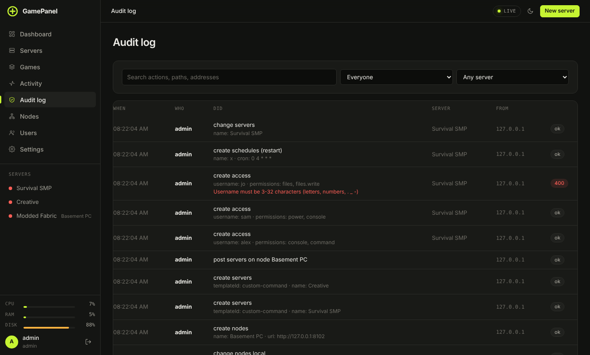

# Panel settings, limits and the audit log

**Settings** holds the panel-wide options. Options for one server are on that server's own Settings tab.

| Card | |
|---|---|
| **Alerts** | Where alerts go and which ones. [Alerts and Discord](alerts-and-discord.md) |
| **GamePanel Bridge** | Turns on the Connections page. [Bridge](../bridge.md) |
| **Panel updates** | Check for and install a new GamePanel version |
| **Runtime** | Whether servers run in Docker containers (Linux) |
| **Limits** | Caps for the whole panel, below |
| **Discord bot** | Slash commands in your Discord. [More](alerts-and-discord.md#discord-bot) |
| **Integrations** | CurseForge, Steam Web API and Factorio keys for the mod browser; Cloudflare for `play.example.com` addresses |
| **Cloud backups** | [Cloud copies](backups.md#cloud-copies) |
| **Public status page** | [Status page](alerts-and-discord.md#public-status-page) |
| **General** | Panel name, port range for new servers, crash auto-restart and how often, automatic Steam game updates, sign-in locations |
| **System** | Version and host details, **Reload templates**, **Back up panel settings** |

## HTTPS

**Settings → HTTPS** gets a free Let's Encrypt certificate so the panel opens at `https://your.domain` with no reverse proxy (passkeys and the phone app away from home need this). Point the domain at the machine, enter it, and press **Get a certificate**. Let's Encrypt checks the domain over port 80, which has to reach this machine while the certificate is issued; if it cannot, pick **Cloudflare DNS** and add a Cloudflare token under Integrations. The certificate renews itself. Plain-HTTP visits to the domain are sent to HTTPS, while the IP address and the usual port keep working.

## SFTP

**Settings → SFTP** turns on an SFTP server (port 2022 by default) for FileZilla, WinSCP, Cyberduck or `sftp`. People sign in with their panel username and password (plus their authenticator code if they use one) and see the folders of the servers they may browse; changing files needs "Upload, edit and delete files". Sign in as `alice.<server id>` to open one server directly. The server's key fingerprint is shown in Settings and on each server's Files tab (the **SFTP** button). There is no shell.

## Update channels

Under Panel updates, pick **Stable** (tagged releases) or **Beta** (newer builds as they land).

## Limits

Caps for the whole panel. Leave a field at 0 for no limit.

| Limit | Checked |
|---|---|
| **Max memory for running servers (GB)** | When a server starts: the memory limits of all running servers together can't go over it. |
| **Max CPU cores per server** | Applied to container servers that have no CPU cap of their own. |
| **Max storage for servers and backups (GB)** | Before installs, updates and backups. |

The card shows what's in use now next to what the machine has. Game servers run headless and don't use
the GPU, so there's nothing to cap there.

## Automatic game updates

**Settings → General → Update Steam games automatically** checks Steam every 30 minutes for each SteamCMD
game. When a new build is out it waits until nobody is playing, updates, and starts the server again.
Each server can follow this setting or override it on its own **Settings → Automatic game updates**.

## Panel updates

**Settings → Panel updates → Check for updates** shows what's new and installs it. On Linux it pulls the
latest code; on Windows it downloads the latest release. The panel restarts; servers running in
containers keep running and the panel re-attaches to them. From a terminal, `sudo /opt/gamepanel/update.sh`
does the same on Linux, or run the installer again on either system. Your servers and settings stay.

## Audit log

**Audit log** in the sidebar (administrators) lists every change made through the panel or the API: when,
who, what they did, which server and from which address, and whether it worked. Search by action, path or
address, and filter by person or server. It's kept in `audit.log` in the data folder and rotates at 5 MB.

## Activity

**Activity** in the sidebar is the friendlier feed: servers starting and crashing, installs, backups,
sign-ins (with a rough location, which you can turn off under **General**) and player search across every
server.

## Environment variables

For the service itself (Linux: `sudo systemctl edit gamepanel`):

| Variable | Default | |
|---|---|---|
| `GP_PORT` | `8420` | Panel port |
| `GP_HOST` | `0.0.0.0` | Address to listen on |
| `GP_DATA_DIR` | `/var/lib/gamepanel`, `C:\ProgramData\GamePanel` | Where servers and settings live |
| `GP_BEHIND_PROXY` | `0` | Trust `X-Forwarded-*` headers behind a reverse proxy |
| `GP_DOCKER_SOCKET` | `/var/run/docker.sock` | Docker socket |
| `GP_LOG_LEVEL` | `info` | `debug`, `info`, `warn`, `error` |
