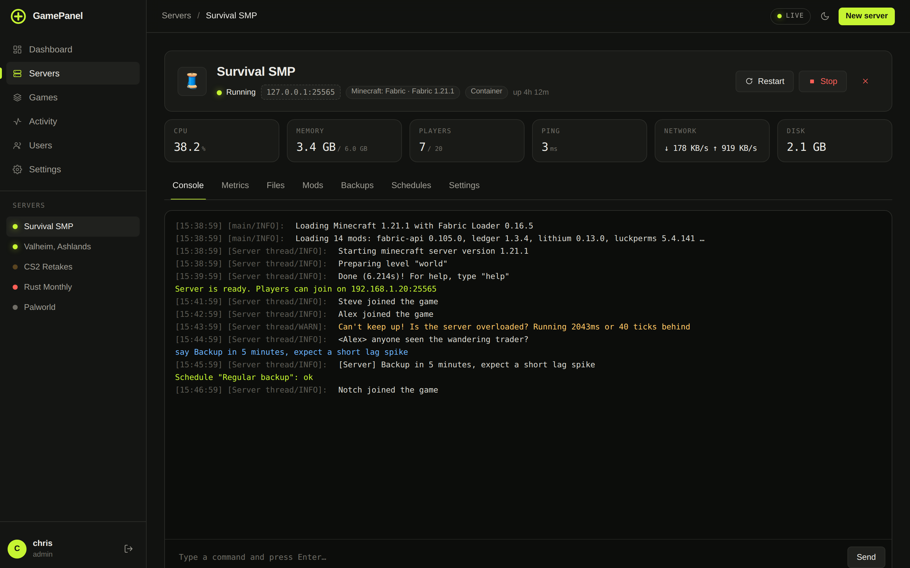
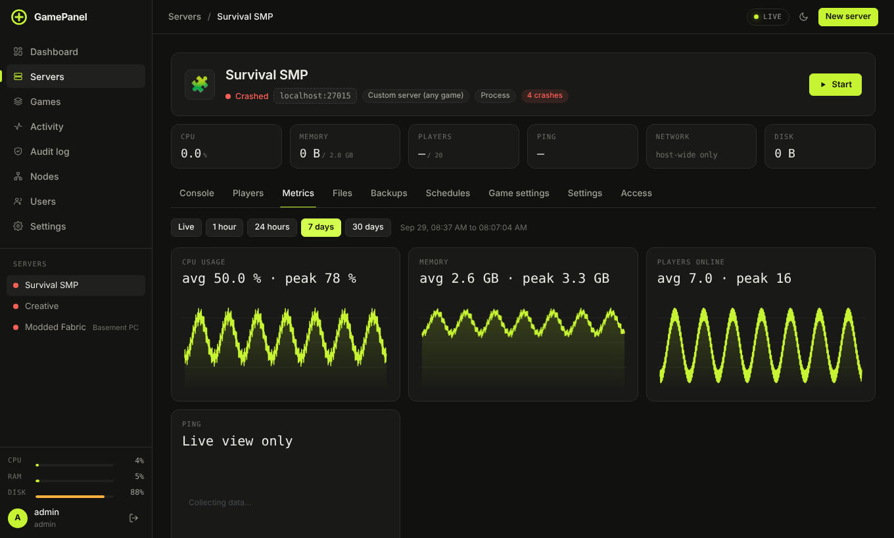
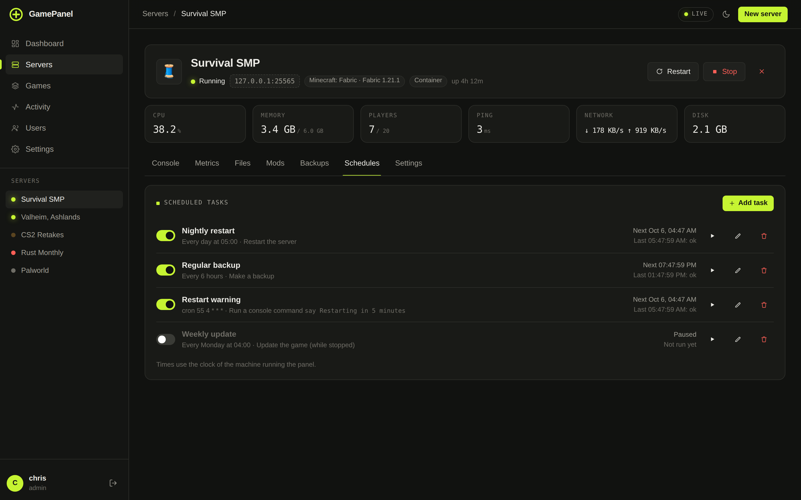

# Running a server

Open a server from the sidebar or **Servers**. The header shows its status, the address to join (click to
copy), the game and version, and live CPU, memory, players and ping. Start, stop and restart are on the
right. Below that are the tabs; you only see the ones your account is allowed to use.

| Tab | |
|---|---|
| **Console** | Live output and commands |
| **Players** | Who is on, history, whitelist and bans. [Players](players.md) |
| **Metrics** | Graphs |
| **Files** | File browser and editor |
| **Modpack** / **Mods** | For games that support them. [Mods and modpacks](mods-and-modpacks.md) |
| **Backups** | [Backups](backups.md) |
| **Schedules** | Restarts, backups and commands on a timer |
| **Game settings** | The game's config as a form, plus versions and worlds for Minecraft |
| **Settings** | Name, memory, ports, alerts, reachability, automatic updates, danger zone |
| **Access** | Who else can use this server. [Users](users-and-2fa.md#sharing-one-server) |

## Console

Output is colour-coded and live. Type a command and press Enter; where the game has RCON the panel uses
it. **↑ / ↓** walks through your command history and **Tab** completes commands and online player
names. Click a player name in the output to open their profile.

**When a server crashes** the console shows the **Crash doctor**: what went wrong in plain words (wrong
Java version, out of memory, EULA not accepted, a broken mod or plugin) with a button that fixes it.
**Share log** uploads the log to mclo.gs so you can send someone a link. Crashed servers restart on
their own unless they crash too often (Settings → General → Max crash restarts).

## Metrics

CPU, memory, players and ping, with a range picker from the last hour up to 30 days. History is kept
per minute for a day and per 15 minutes for 30 days, and survives panel restarts. 100% CPU is one full
core. Paper and Purpur servers also show TPS on the server page.

## Files

Browse, edit, create, rename and delete; drag files onto the page to upload, and **Unpack** a zip where it
is. **Search** looks through file names and contents. JSON and YAML are checked before saving, so a
typo can't stop the server from starting.

## Schedules

**Scheduled tasks** run on a timer: every day at 05:00, every 6 hours, every hour, or any cron expression
(minute, hour, day of month, month, weekday; the clock is the panel machine's).

| Action | |
|---|---|
| Restart / Stop the server | **Warn players first** posts "restarting in 5 minutes", then 1 minute, 30 and 10 seconds |
| Make a backup | |
| Run a console command | `say Server restarts at 5am` |
| Start the server | |
| Update the game | While it's stopped |
| Update mods and plugins | Only compatible updates |

Tick **only when empty** to skip a run while people are playing. **Chat announcements** on the same tab
rotate messages in game chat, and can send new players a first-join welcome.

## Game settings

The game's own config files (`server.properties` and friends) as a searchable form, with a note on what
each option does. **Restart now** applies changes that need a restart. Minecraft servers also get:

- **Version and type:** switch between Vanilla, Paper, Purpur, Fabric, Quilt, Forge and NeoForge, or another
  Minecraft version. The panel stops the server and backs up first.
- **Worlds:** load another world, import a zip, download, reset with a new seed, delete. It backs up first.
- **How it looks in Minecraft:** server icon and coloured MOTD with a live server-list preview.
- **Game rules:** keep inventory, daylight cycle, mob griefing, sleep percentage… Changes apply live.
- **Bedrock crossplay:** one switch installs Geyser, Floodgate and ViaVersion so Bedrock players can join.
- **Live map:** BlueMap on its own port, linked from the status page.
- **Pre-generate the world:** Chunky generates the world ahead of time, with live progress.

## Settings tab

| Card | |
|---|---|
| **General** | Name, memory limit, start command, max players, **stop when empty** after X minutes, **restart when frozen** for X minutes |
| **Automatic game updates** | Follow the panel setting, or force on or off for this server. Steam is checked every 30 minutes, and the update waits until nobody is playing. |
| **Alerts** | CPU, memory, folder size and TPS thresholds, posted to your alert webhook |
| **Address** | A name like `play.example.com` through Cloudflare, when it's set up under Settings → Integrations |
| **Discord channel** | Chat, joins and status into a channel, and messages typed there show up in game |
| **Reachability** | Open the ports in the firewall and on the router. [More](../troubleshooting.md#making-a-server-reachable) |
| **Ports** | Changes apply on the next start |
| **Danger zone** | Duplicate, export, reinstall, delete |

## Servers page

**Start all**, **Stop all** and **Message all** (a chat message to every running server) sit at the
top of **Servers**, next to **Import existing**.
