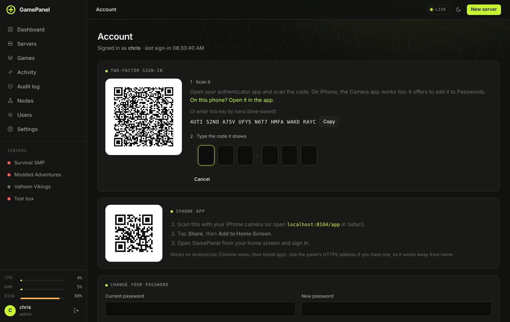

# Users, sub-users and two-factor sign-in

There are two kinds of account:

- **Administrator:** full access to everything, including Settings, Users, Nodes and the audit log.
- **User:** sees only the servers they're given, and can only do what they're allowed to on each.

## Sharing one server

The quickest way to give a friend access is from the server itself: **Access tab → New sub-user** makes
an account that sees that server and nothing else. **Add existing user** gives someone who already has an
account access to this server too.

Pick a preset or tick exactly what they may do:

| Preset | Allows |
|---|---|
| **Console only** | Watch the console and send commands |
| **Start and stop** | Start, stop and restart, and watch the console |
| **Files only** | Browse, download, upload and edit files |
| **Full server access** | Everything on that server: power, console, settings, schedules, files, mods, backups and restores |

The single permissions are: start/stop/restart, view the console, send console commands, edit server
settings (trusted: variables reach the game's command line), manage schedules, browse and download files,
upload/edit/delete files, install and remove mods, create and download backups, restore and delete
backups. Each server can give the same person different permissions. **Change** edits them, and removing
the person takes away only this server.

## The Users page

**Users** lists every account. **New user** creates one with a role. For a user you choose their
**Assigned servers** (hold Ctrl or ⌘ to pick several) and their general permissions, which apply on any
assigned server that has no permissions of its own on the Access tab.

From each row you can **Edit**, **Sign out** (ends all their sessions), **Reset 2FA** and delete.

Only administrators manage accounts, and API keys can never change accounts.

## Two-factor sign-in

Everyone can turn it on for themselves under **Account → Two-factor sign-in** with any authenticator app.
Saving the recovery codes matters: each signs you in once without the phone. **New recovery codes** makes
a fresh set and cancels the old ones.

**Users → Require two-factor for administrators** makes it compulsory for every admin (turn it on for your
own account first). It covers the live connection to the panel too, not just the sign-in page.

Locked out? Another administrator can press **Reset 2FA** for you, or see
[Locked out by two-factor sign-in](../troubleshooting.md#locked-out-by-two-factor-sign-in) to turn it off
from the machine.

## Passwords and sessions

- Passwords need 8 or more characters, can't be a common password and can't be just the username.
- **Account → Change your password** signs you out everywhere else. **Sign out other devices** does just
  that.
- Sign-ins are slowed down after wrong passwords, per address and per account, and can raise an alert.
  An alert can also fire when someone signs in from a new address.
- Sessions last 7 days.

## Who did what

Everything people change through the panel or the API lands in the [audit log](panel-settings.md#audit-log).
